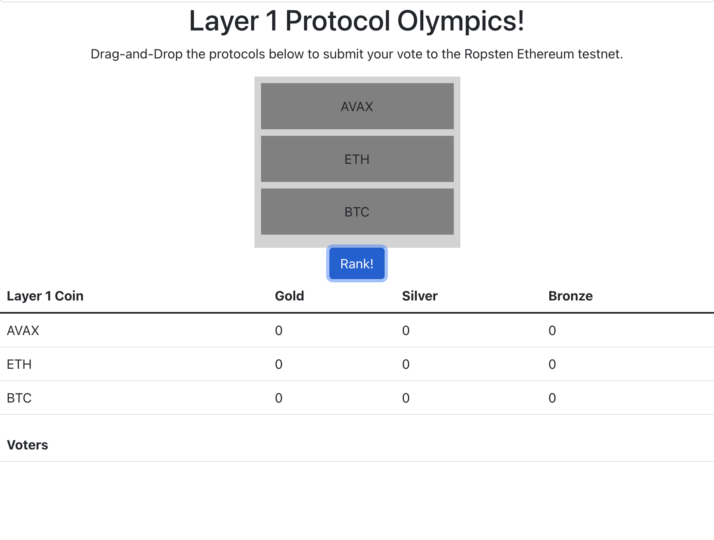
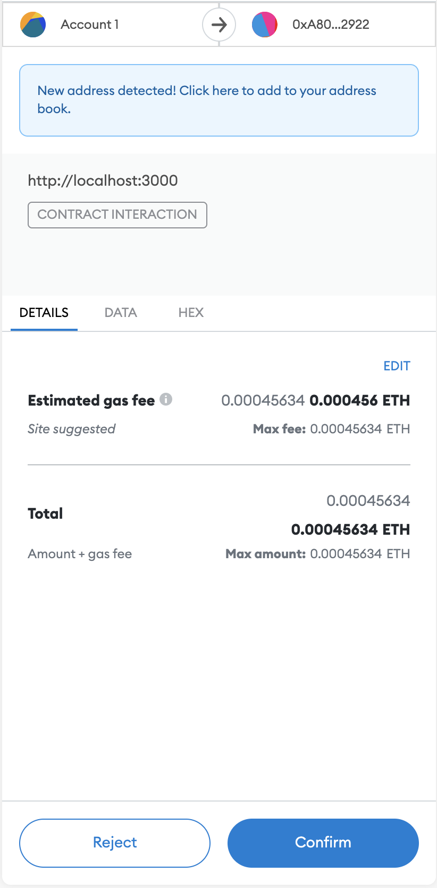
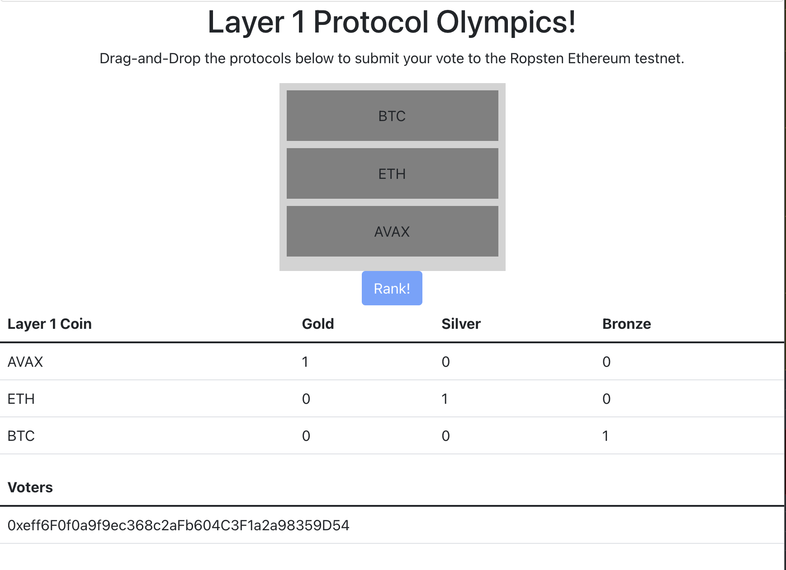
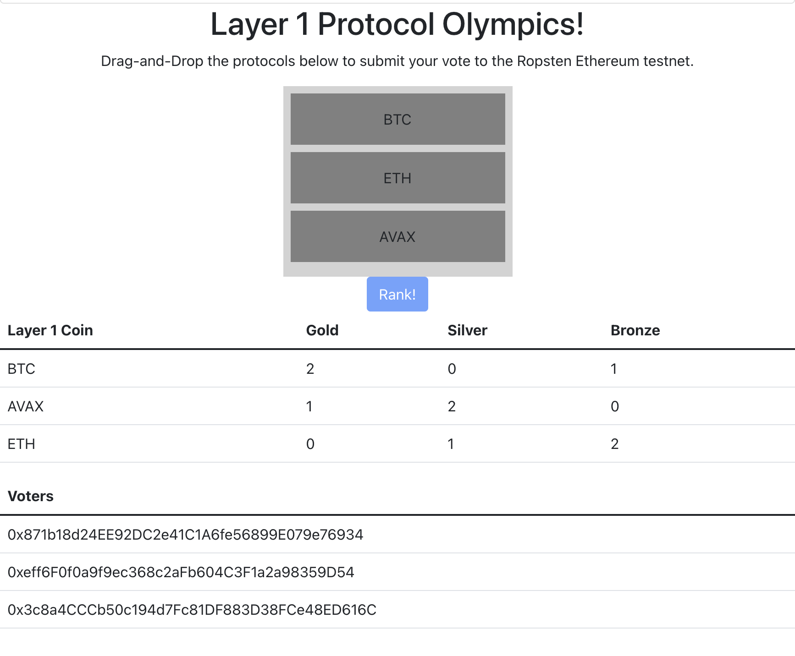

# Getting Started
- Install MetaMask: <https://metamask.io/download/>
- Install truffle globally: **npm install -g truffle** and download ganache <https://trufflesuite.com/ganache/>
- In one terminal session, Run **truffle develop** from project directory. You should see Truffle Develop started at <http://127.0.0.1:8545/> (or something along these lines). Keep track of the address as well as the Mnemonic which will be provided (this will be needed in the next step).
- Setup Ganache on Metamask: <https://trufflesuite.com/docs/truffle/getting-started/truffle-with-metamask.html> (chainId: 1337)

# Setting up the Frontend
- In another terminal session, **cd client**, **npm run start**
- In the truffle develop terminal session, run **migrate --reset**
- Accept MetaMask connection to <https://localhost:3000>
- In the browser console, if you see errors such as **did you run out of gas**, **tx does not have correct nonce**, etc., go to metamask, settings --> advanced --> reset account and refresh page.

# Using Frontend
- Drag and drop level 1 coins from your favorite to least favorite, most promising to least promising, most bullish to least bullish, etc and then select rank.

- Accept gas fee (metamask transaction will pop up).

- Final Result:

- Users who have already voted cannot vote again, but you can simulate new users via metamask and ganache (you are provided with 10 default accounts). In metamask, click the upper right hand side button, create account, create. Connect this account to <https://localhost:3000> (upper left hand corner). Then reset account (see instructions above) and refresh page.

-Final Result (3 accounts added).

# Upcoming Changes
- Linked List data structure to store voters to reduce gas costs.
- Running application on Ropsten Test net, deploying via IPFS.
